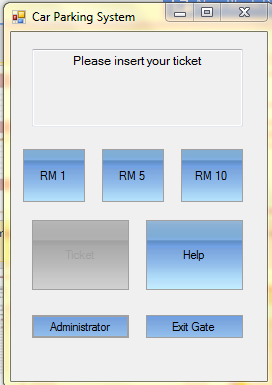

**TSE2101 **

**Final Report **

**for**

**Car Parking System**

**Version 3.0**

**Group No: TT09**

|                   |                |     |
|-------------------|----------------|-----|
| **Wong Zi Xiang** | **1142701102** |     |
| **Goh Chen Hui**  | **1151302075** |     |
| **Gan Ka Jing**   | **1151300880** |     |

|           |                                      |
|-----------|--------------------------------------|
|           |                                      |
|           |                                      |
| **Date:** | ***23th September 2016*** |

Contents

Contents 2

Revisions 3

1 Project Management 4

1.1 Team Members 4

1.2 Project Plan 4

2 System Overview 5

2.1 Description 5

2.2 Actors 6

2.3 Assumptions and Dependencies 6

2.4 Use Case Diagram 6

3.1 User 7

3.3 Class Diagrams 14

3.4 Sequence Diagram 15

4 Behavioural Requirements 18

4.1 State Diagrams 18

4.2 Data Flow Diagrams 19

5 Database Requirements 20

5.1 Table Definition 20

6 Data Design 21

6.1 Data Dictionary 21

7 Architecture Design 22

7.1 Architecture Diagram 22

3.13 Exit Gate System 24

3.14 Admin System 24

8 Interface Design 25

8.1 Main Screens 25

9 Component Design 28

9.1 Main Components 28

10 Deployment Design 36

10.1 Deployment Diagram 36

11 Test Data 37

11.1 Test Data Set 1 – Take Ticket 37

11.2 Test Data Set 2 – New Driver Take Ticket 37

11.3 Test Data Set 3 – Driver Pay Ticket 37

12 Acceptance Test 38

12.1 Acceptance Test 1 - User 38

12.2 Acceptance Test 2 – Auto Pay Machine 38

12.3 Acceptance Test 3 – Ticket Machine 38

13 Sample Screens 39

Driver get the ticket from entrance ticket machine and obtain help if the ticket machine is malfunction. 39

After the Driver insert ticket, amount need to pay will be shown on the screen. 39

Exit ticket machine after received paid ticket. 40

Admin Login and changing parking rate and view revenue. 40

14 Conclusion 41

14.1 Summary of Results 41

14.2 Problems Encountered 41

14.3 Limitations and Future Enhancements 41

Revisions

|         |                   |                                                                                                                                                   |                |
|---------|-------------------|---------------------------------------------------------------------------------------------------------------------------------------------------|----------------|
| Version | Primary Author(s) | Description of Version                                                                                                                            | Date Completed |
| V1.0    | Wong Zi Xiang     
                     
  Goh Chen Hui       
                     
  Gan Ka Jing        | Planning and modeling of the project.                                                                                                             | 28/7/16        |
| V2.0    | Wong Zi Xiang     
                     
  Goh Chen Hui       
                     
  Gan Ka Jing        | Added data dictionary, architecture diagram, interface design diagram, component diagram and deployment diagram.                                  | 25/8/16        |
| V3.0    | Wong Zi Xiang     
                     
  Goh Chen Hui       
                     
  Gan Ka Jing        | Added test data, acceptance test and sample screen. Updated data flow diagram, class diagram, sequence diagram, data design and activity diagram. | 23/09/16       |

Project Management
==================

Team Members
------------

|               |              |                              |
|---------------|--------------|------------------------------|
| **Name**      | **Position** | **Assigned Actors**          |
| Wong Zi Xiang | Leader       | Ticket Machine & Pay Machine |
| Goh Chen Hui  | Member       | Driver & Admin               |
| Gan Ka Jing   | Member       | Technical Support            |

Project Plan
------------

For this project, we used the conventional waterfall model. The four main activities in the project are communication, modeling, construction and deployment. Communication will take around 5 days. During this activity we discussed the requirement of the system, background research of similar and related system, and non-functional requirements. Modeling will take around 3 weeks. In modeling we created use-case diagram, class diagram and sequence diagram. Construction will take around 1 and half month. We will begin implementation and testing of the system based on the model we created during modeling. Finally it will be deployment which will take around a week. We will prepare for presentation of the system and present the prototype.

**Figure 1: Gantt Chart**

System Overview
===============

Description
-----------

Car parking system, as the project name implies it must allow people to park their cars. But no one in their right mind will let anyone park for free, that is why a system is needed. There will be a barricade at the entrance and exit of the car park which is managed by the system. The machine at the entrance will dispense a ticket and allow driver to enter the car park after the driver has taken the ticket. When the driver wants to exit the car park, he or she will have to pay the parking fee which is set by administrator using a machine located within the car park. The machine will then process the ticket and the driver will need to insert the ticket into the machine located at the exit so that the barricade will open and allow driver to exit. The driver can contacts technical support if encountered any error while operating the machines.

**Figure 2: Data Flow Diagram Context Level**

Actors
------

There are 5 actors in the car parking system, there are 2 actors, admin and driver which will interact with other actors, which is ticket machine, pay machine and technical support. Driver will be able to get ticket and return ticket to ticket machine or even ask for help from technician support. Admin can change the parking rate and view the overall revenue from the parking fee

Assumptions and Dependencies
----------------------------

-   Car must passes through barricade when entering and exiting upon open

-   Ticket is not lost

-   Driver always has enough money to pay the parking fees

-   Payment is made within the 24 hours

-   There is only 1 administrator

Use Case Diagram
----------------

1.  **Basic Requirements**

User
----

1.  **Use case 1**

| Use case 1           | Take ticket                                                   |
|----------------------|---------------------------------------------------------------|
| Brief description    | User take ticket                                              |
| Initial step-By-Step | 1.  User arrive entrance                                      
                                                                 
  2.  User press ticket button                                   
                                                                 
  3.  Program will check ticket and space availability           
                                                                 
  4.  If available, ticket will dispense                         
                                                                 
  5.  User can also contact technical support if facing problem  |

1.  **Use case 2**

| Use case 2           | User direction                                                    |
|----------------------|-------------------------------------------------------------------|
| Brief description    | User select where to go                                           |
| Initial step-By-Step | 1.  User will select where to go, either pay machine or exit gate |

1.  **Use case 3**

| Use case 3           | Pay machine                                                        |
|----------------------|--------------------------------------------------------------------|
| Brief description    | User pay money                                                     |
| Initial step-By-Step | 1.  User arrive pay machine                                        
                                                                      
  2.  User insert ticket                                              
                                                                      
  3.  Program will calculate the Fee                                  
                                                                      
  4.  User pay fee                                                    
                                                                      
  5.  If money paid &gt;= fee                                         
                                                                      
  6.  Return ticket                                                   
                                                                      
  7.  User can also choose administrator / exit gate / contact admin  |

1.  **Use case 4**

| Use case 6           | Exit gate                                                    |
|----------------------|--------------------------------------------------------------|
| Brief description    | User exit from parking                                       |
| Initial step-By-Step | 1.  User return ticker                                       
                                                                
  2.  Program check if the ticket is paid                       
                                                                
  3.  If paid, open gate                                        
                                                                
  4.  User can go to pay machine and contact technical support  |

1.  **Admin**

    1.  **Use case 5**

| Use case 4           | Admin login page                                      |
|----------------------|-------------------------------------------------------|
| Brief description    | Admin login                                           |
| Initial step-By-Step | 1.  Admin key in ID and password                      
                                                         
  2.  Proceed to Admin mode if ID and password is valid  
                                                         
  3.  Admin can also contact technical support           |

1.  **Use case 6**

| Use case 5           | Admin page                                           |
|----------------------|------------------------------------------------------|
| Brief description    | Admin view revenue and update parking rate           |
| Initial step-By-Step | 1.  Program display revenue and current parking rate 
                                                        
  2.  Admin can input new parking rate                  
                                                        
  3.  Program update parking rate                       |

Class Diagrams
--------------

> 
>
> There are a total of 6 classes in this system, Driver, PayMachine, Admin, TechnicalSupport and Ticket. Driver will be instantiated as we will need to simulate a real driver holding tickets and performing actions. PayMachine also will be instantiated as many core functions of the system are performed here. Admin is also instantiated to simulate real administrator configuring pay machine. TechnicalSupport will not be instantiated as they only have one function with is easily represented by a message box. Ticket are instantiated every time there is a driver taking a ticket from entrance.

Sequence Diagram
----------------

### Driver get ticket from ticket machine.

Driver get ticket from ticket machine, barricade will be raised by ticket machine. Driver can contact technical support if machine malfunctioned.

### Driver put the ticket into pay machine to pay the parking fee

Driver insert ticket and pay the parking fee using pay machine and ticket will be returned after finishes payment

### Driver insert the ticket check out

Driver insert card into ticket machine, the ticket machine will check the ticket status, if true , gate open; if false, gate remains closed and display reminder.

### Admin need to login, then only can check the parking rate and revenue.

Admin needs to key in username and password and the pay machine will check whether it is correct. If correct, admin mode is enabled and admin can check revenue and change parking rates here.

Behavioural Requirements
========================

State Diagrams
--------------

First user will go through dispense ticket state. After took the ticket, user can choose go to exit gate or pay machine. At the pay machine, user can go into admin mode if verifying success, admin mode can edit parking rate. After user inserted ticket, program will calculate fee and collect money from user. At the exit gate, program will scan the ticket if the ticket had paid. If paid, it will open gate.

Data Flow Diagrams
------------------

> 
>
> After user take ticket, the ticket will store pay status, id, entertimestamp and exittimestamp into data base. User will need to pay at the ticket machine, the system will calculate fee according to parking rate after taking id, pay status, entertimestamp and exittimestamp from database. At the pay machine, admin can edit the parking rate if password and username match date from paymachine. Pay machine will also update revenue for admin to view. On the exit gate, user will return ticket and exit gate will get ticket id and pay status from database.

Database Requirements
=====================

Table Definition
----------------

1.  **Relational Table**

> 

Data Design
===========

Data Dictionary
---------------

### Ticket

|                  |         |                                                       |
|------------------|---------|-------------------------------------------------------|
| Parameters       | Type    | Description                                           |
| enterTimestamp   | Date    | Enter time of driver                                  |
| paymentTimestamp | Date    | Time when ticket is paid                              |
| payStatus        | Boolean | payStatus = true for paid and false for unpaid ticket |
| hrs              | Int     | Store number of hours parked                          |
| mins             | Int     | Store number of minutes parked                        |
| ID               | Int     | Unique number of each ticket                          |

### Ticketing Machine

|              |              |                                              |
|--------------|--------------|----------------------------------------------|
| Parameters   | Type         | Description                                  |
| ticketRemain | Unsigned Int | Numbers of ticket remain in ticketing macine |
| spaceRemain  | Unsigned Int | Numbers of empty parking space               |

### Auto Pay Machine

|            |        |                             |
|------------|--------|-----------------------------|
| Parameters | Type   | Description                 |
| rate       | Double | Fees per hour for parking   |
| revenue    | Double | Total revenue earned        |
| username   | String | Username for admin login    |
| password   | String | Password for admin login    |
| feesPaid   | Double | Total amount paid by driver |
| fees       | Double | Amount needed to pay        |

Architecture Design
===================

Architecture Diagram
--------------------

*Architecture Diagram*

Object-oriented architecture is a design paradigm based on the division of responsibilities for an application or system into individual reusable and self-sufficient objects, each containing the data and the behavior relevant to the object. The main system is the car parking ticket system itself. The subsystem can be divided into entrance gate system, auto pay system, admin system and exit gate system.

Driver will have entrance gate interface to getTicket or getHelp if the entrance gate is malfunction. After that, driver will have to payTicket by insertTicket into the auto pay machine. Driver also can getHelp if they encounter any problem. In the end, driver will have exit gate interface which only need driver to insertTicket.

The admin can access the admin system by login into the subsystem. After correct user name and password is entered, the admin can changeRate or viewRevenue or even getHelp if encounter any technical problem. The admin system can be accessed by inputting the correct username and password.

### Entrance Gate System

*Subsystem 1: Entrance Gate System*

Entrance gate system will be able to open the gate to let the driver in and dispense the ticket to them.

### Auto Pay System

Subsystem 2: Auto Pay System

Auto pay system will be able to calculate the parking fee and return change to the driver. Besides, it can logged-in by admin to access admin’s function.

3.13 Exit Gate System
=====================

*Subsystem 3: Exit Gate System*

Exit gate system will be able to read the ticket status. If the status is paid, then the gate will be open to let the driver to leave the car park.

3.14 Admin System 
==================

Subsystem 4: Admin System

Admin system will be able to get the username and password to verify the identity. After logged in, the user is granted access to set the parking rate on the pay machine or check the revenue.

Interface Design
================

Main Screens
------------

Driver would need to get their ticket here before they can park inside.

*Main Screen: Entrance GUI*

### Choice screen

This screen is to simulate real life reaction, people might be forgetful and go straight to exit instead of paying their ticket.

*Screen 1: Choice Screen*

### Auto Pay Machine

There will be two UI, which is for driver and admin. Driver can pay the parking fee here and admin can check and change the parking rate here. Both UI can contact help center if problems occur.

*Screen 2: Driver’s Auto Pay Machine*

*Screen 3: Admin’s Auto Pay Machine*

 Component Design
=================

 Main Components
----------------

The main components are **Technical Support,** **Entrance Ticketing Machine,** **Exit Ticketing Machine** and **Auto Pay Machine**. **Technical Support** is used when admin or driver need helps on something, such as gate not opening, pay machine error, admin cannot login. **Entrance Ticketing Machine** is for when the driver wants to enter the parking. **Exit Ticketing Machine** is for when the driver wants to exit the parking. Finally, **Auto Pay Machine** is for driver to pay their ticket. Admin can access **Auto Pay Machine** for modifying parking rates and checking revenue.

Component Diagram

### Entrance Ticketing Machine

This component will dispense ticket when the ticket button is pressed and open the gate for driver to enter.

Component 1: Entrance Ticketing Machine

**Algorithm**

Entrance Ticketing Machine

1.  **If** ticket button pressed

2.  Check remaining ticket and parking space

3.  **If** remaining ticket equals 0

4.  Display “No parking ticket left”

5.  **If** remaining parking space equals 0

6.  Display “No parking space left”

7.  Set timestamp

8.  Dispense ticket

9.  Open gate

10. **If** help button pressed

11. Request help from technical support

**Activity diagram**

Activity Diagram 1: Entrance Ticketing Machine

### Exit Ticketing Machine

This component will require driver to insert their parking ticket and the component will check whether the ticket is paid or not. If paid, the gate will be opened.

Component 2: Exit Ticketing Machine

**Algorithm**

Exit Ticketing Machine

1.  **If** payStatus equals **true**

2.  Open gate

3.  **Else **

4.  Display “You haven’t pay your ticket yet!”

5.  **If** help button pressed

6.  Request help from technical support

**Activity diagram**

Activity Diagram 2: Exit Ticketing Machine

### Auto Pay Machine

This component main usage is for drivers to pay their parking ticket so they can leave the parking. Administrator can also access this component to check the revenue and change the parking rate.

Component 3: Auto Pay Machine

**Algorithm**

Driver

1.  Read card

2.  Get enter time

3.  Price = rate \* ( payment time – enter time ) // Time is rounded off to floored to hours

4.  Display price

5.  Insert payment

6.  change = payment – price

7.  Set payStatus = true

8.  Return ticket

9.  Return change

Admin

1.  Input username and password

2.  **While** username or password is wrong

3.  Input username and password

4.  Display revenue

5.  **If** change parking rate chosen

6.  Input new parking rate

7.  parking rate = new parking rate

8.  **If** help button pressed

9.  Request help from technical support

**Activity Diagram**

> Activity Diagram 3: Admin’s Auto Pay Machine
>
> 
>
> Activity Diagram 4: Driver’s Auto Pay Machine

 Deployment Design
==================

 Deployment Diagram
-------------------

User can interact with three applications. First is entrance gate, where use must pass through and get a ticket from before entering, timestamps are set in the ticket and database here. Next is pay machine, this is where user can pay parking fee accordingly to the hour user park, the ticket’s status will then be set to paid in both database and ticket itself. If user is admin, he can login and check the revenue and change parking rate here. Third is exit gate where user must insert the ticket before leaving, this machine will check whether the ticket is paid or not. All the application is connected to a database and every necessary users’ detail are store inside the database.

Deployment Diagram

 Test Data
==========

 Test Data Set 1 – Take Ticket
------------------------------

|     |                      |                      |           |
|-----|----------------------|----------------------|-----------|
| ID  | enterTimestamp       | exitTimestamp        | payStatus |
| 0   | 23/9/2016 1:52:37 AM | 23/9/2016 2:22:39 AM | False     |

 Test Data Set 2 – New Driver Take Ticket
-----------------------------------------

|     |                      |                      |           |
|-----|----------------------|----------------------|-----------|
| ID  | enterTimestamp       | exitTimestamp        | payStatus |
| 0   | 23/9/2016 1:52:37 AM | 23/9/2016 2:22:39 AM | False     |
| 1   | 23/9/2016 1:55:42 AM | 23/9/2016 2:01:45 AM | False     |

 Test Data Set 3 – Driver Pay Ticket
------------------------------------

|     |                      |                      |           |
|-----|----------------------|----------------------|-----------|
| ID  | enterTimestamp       | exitTimestamp        | payStatus |
| 0   | 23/9/2016 1:52:37 AM | 23/9/2016 2:22:39 AM | True      |
| 1   | 23/9/2016 1:55:42 AM | 23/9/2016 2:01:45 AM | True      |

 Acceptance Test 
=================

 Acceptance Test 1 - User
-------------------------

|                                                    |            |
|----------------------------------------------------|------------|
| Criteria                                           | Fulfilled? |
| Able to take ticket                                | -          |
| Ticket’s data stored in database                   | -          |
| Able to navigate between interface without problem | -          |

 Acceptance Test 2 – Auto Pay Machine
-------------------------------------

|                                                |            |
|------------------------------------------------|------------|
| Criteria                                       | Fulfilled? |
| Read ticket’s data                             | -          |
| Make payment                                   | -          |
| Update ticket’s data in database after payment | -          |
| All buttons functioning                        | -          |
| Admin able to access and configure             | -          |

 Acceptance Test 3 – Ticket Machine
-----------------------------------

|                                                 |            |
|-------------------------------------------------|------------|
| Criteria                                        | Fulfilled? |
| Dispense ticket                                 | -          |
| Insert ticket’s data to database after dispense | -          |
| Get remaining space and ticket                  | -          |
| Read ticket’s data from database                | -          |
| All buttons functioning                         | -          |

 Sample Screens
===============

Driver get the ticket from entrance ticket machine and obtain help if the ticket machine is malfunction.
--------------------------------------------------------------------------------------------------------

After the Driver insert ticket, amount need to pay will be shown on the screen.
-------------------------------------------------------------------------------

Exit ticket machine after received paid ticket.
-----------------------------------------------

Admin Login and changing parking rate and view revenue.
-------------------------------------------------------

 Conclusion
===========

 Summary of Results
-------------------

Car parking system is a program for managing fees-charging car parks. This allow conventional method of parking cars to be automated, no manpower are needed to look after the gate and accept payment, only machines. The only manual operations are administrator configurations and technical support. In overall, this system largely improved the efficiency of fees-charging car parks by automating most of the processes.

 Problems Encountered
---------------------

The problem we encountered in the project are lack of time management skill and inadequate programming skills for the project. Our project program may contain some bug because we are lack of time. Our program is definitely not a perfect program like closed source program since our programming skills are still amateur, so it might take a longer time to produce a more quality program.

 Limitations and Future Enhancements
------------------------------------

The limitations of the software is the pay machine cannot insert coin as payment which may cause inconvenient for the customer. Our program also do not have Touch 'n Go which is quite a popular payment method right now. The future improvement for the system is able to offer Touch 'n Go as an alternative payment beside using cash, which will improve the flexibility of the current system compare to the current system which only accept cash.
